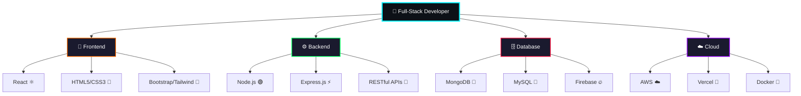

<div align="center">

#  Hi there, I'm Nguyễn Tấn Nghị 


<p>
	 
	
	
</p>

</div>

---

## <picture></picture> About Me


### 🚀 Who Am I?

🎓 **4th Year Software Engineering Student** at [Industrial University of Ho Chi Minh City (IUH)](https://iuh.edu.vn/)

💡 **Full-Stack Developer** specializing in modern web technologies

🌟 **Tech Enthusiast** passionate about creating innovative solutions

### 💻 What I Do

- 🔥 Build **scalable web applications** with **React** ecosystem
- 🛠️ Develop **RESTful APIs** using **Node.js** and **Express**
- 🗄️ Design **database schemas** with **MongoDB** and **MySQL**
- ☁️ Deploy applications on **AWS** and modern hosting platforms
- 🧮 Solve algorithmic challenges on **LeetCode**, **Codeforces**, **HackerRank**

### 🎯 Current Goals

- 🚀 Master **microservices architecture**
- ☁️ Deep dive into **AWS Cloud Solutions**
- 📱 Expand into **React Native** for mobile development
- 🎨 Enhance **UI/UX design** skills

📫 **Reach me at:** [nguyentannghi5722@gmail.com](mailto:nguyentannghi5722@gmail.com)

---


## 🛠️ Tech Arsenal

<div align="center">

<table>
<tr>
<td align="center" width="50%">

### 💻 Programming Languages
<p>
  
</p>

### 🎨 Frontend Technologies  
<p>
  
</p>

### ⚙️ Backend & Database
<p>
  
</p>

</td>
<td align="center" width="50%">

### ☁️ Cloud & DevOps
<p>
  
</p>

### 🔧 Development Tools
<p>
  
</p>

### 🖥️ Operating Systems
<p>
  
</p>

</td>
</tr>
</table>

</div>

---

<div align="center">


---

<div align="center">

### 🌟 Learning Journey & Expertise


</div>

<table align="center" style="border: none;">
<tr>
<td align="center" width="50%" style="border: none;">

<div align="center">

### 💻 **Full-Stack Development**


🎯 **Expert Level** | *Building scalable web applications*

---

### 🚀 **MERN Stack**


🔥 **Advanced** | *MongoDB • Express • React • Node.js*

---

### ☁️ **Cloud Computing (AWS)**


📚 **Learning** | *AWS Solutions Architect*

</div>

</td>
<td align="center" width="50%" style="border: none;">

<div align="center">

### 📱 **Mobile Development (React Native)**


🌱 **Learning** | *Cross-platform mobile apps*

---

### 🧮 **Data Structures & Algorithms**


⚡ **Advanced** | *Problem solving & Optimization*

---

### 🏗️ **System Design**


🎓 **Learning** | *Scalable Architecture Patterns*

</div>

</td>
</tr>
</table>

<div align="center">


### 💫 Tech Stack Summary



</div>
---

<div align="center">

## <picture></picture> Competitive Programming

<table>
<tr>
<td align="center">
<a href="https://leetcode.com/NguyenTanNghi/">

<br><b>Algorithm Master</b>
</a>
</td>
<td align="center">
<a href="https://codeforces.com/profile/NguyenTanNghi">

<br><b>Problem Solver</b>
</a>
</td>
<td align="center">
<a href="https://www.hackerrank.com/NguyenTanNghi">

<br><b>Code Warrior</b>
</a>
</td>
</tr>
</table>

</div>

---

<div align="center">

##  Let's Connect!

<p>
<a href="mailto:nguyentannghi5722@gmail.com">
  
</a>
<a href="https://github.com/NguyenTanNghi">
  
</a>
<a href="https://www.linkedin.com/in/nguyentannghi">
  
</a>
<a href="https://www.facebook.com/tannghi.nguyen.750">
  
</a>
<a href="https://www.instagram.com/tnghi2502/">
  
</a>
</p>

</div>

---


## <picture></picture> GitHub Analytics

<div align="center">

<details open>
<summary><b>📊 GitHub Overview</b></summary>
<br>
<p align="center">
    
    
</p>
</details>

<details>
<summary><b>🔥 Contribution Streak</b></summary>
<br>
<p align="center">
    
</p>
</details>

<details>
<summary><b>⚡ Recent GitHub Activity</b></summary>
<br>
<p align="center">
    
</p>
</details>

</div>

---

<div align="center">

## 🐍 Watch My Contributions Get Eaten!

<picture>
  <source media="(prefers-color-scheme: dark)" srcset="https://github.com/NguyenTanNghi/NguyenTanNghi/blob/output/github-contribution-grid-snake-dark.svg">
  <source media="(prefers-color-scheme: light)" srcset="https://github.com/NguyenTanNghi/NguyenTanNghi/blob/output/github-contribution-grid-snake.svg">
  
</picture>

</div>

---

<div align="center">

### 💫 Fun Fact

```typescript
const nghiProfile = {
  name: "Nguyễn Tấn Nghị",
  role: "Full-Stack Developer",
  location: "Ho Chi Minh City, Vietnam",
  education: "Software Engineering @ IUH",
  
  currentlyLearning: ["AWS", "React Native", "System Design"],
  techStack: {
    frontend: ["React", "HTML5", "CSS3", "Bootstrap", "TailwindCSS"],
    backend: ["Node.js", "Express.js", "RESTful APIs"],
    database: ["MongoDB", "MySQL", "Firebase"],
    tools: ["Git", "Docker", "Postman", "VS Code"]
  },
  
  motto: "Code with passion, learn with purpose! 🚀"
};
```


</div>

---

<p align="center">
  
  <br>
  <b>⭐ Star my repos if you find them interesting!</b>
</p>
